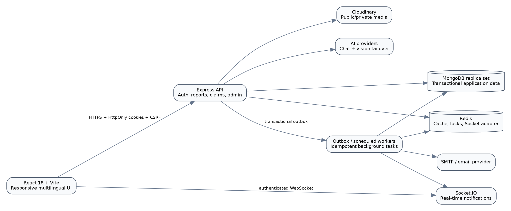
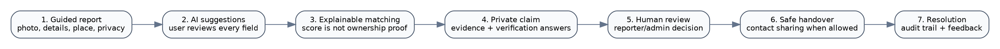
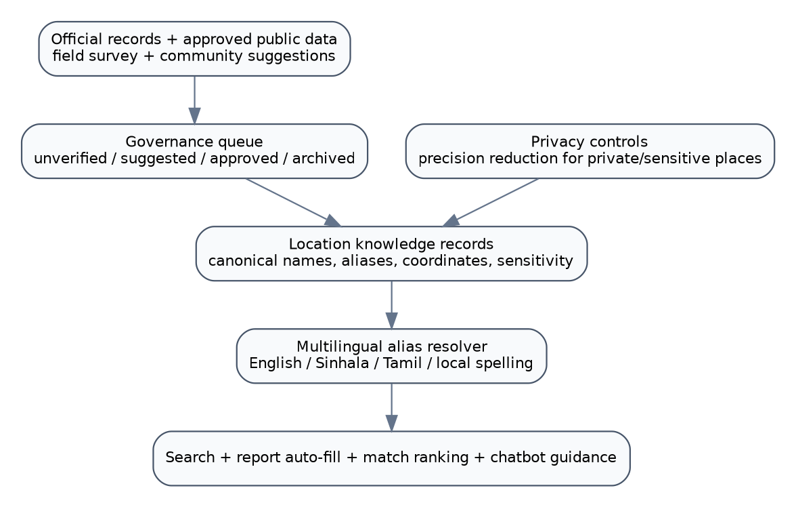

# Executive Summary

The **Smart Lost & Found Management System** is a privacy-conscious, multilingual, AI-assisted platform designed for the South Eastern University of Sri Lanka (SEUSL) community. It replaces fragmented notice-board, social-media and office-based practices with one auditable workflow for reporting, searching, matching, claiming, verifying, handing over and closing lost-property cases.

The system is implemented as a MERN application using React, Node.js, Express and MongoDB. Redis supports caching, distributed locks and real-time scaling; Socket.IO provides live notifications; Cloudinary is supported for managed image storage; email providers support account and workflow messages; and pluggable AI chat and vision providers assist search, image analysis and matching. Core operations continue to offer deterministic/manual fallbacks when optional providers are unavailable.

The current source is a **hardened release candidate**, not an institutionally certified production release. Source-level security, workflow, AI, multilingual, accessibility, documentation and release-hygiene work has been completed to the extent verifiable in the available environment. Final certification still requires a clean target environment, real provider credentials, a MongoDB replica set, Docker and browser testing, backup/restore evidence, institutional privacy/security approval and signed UAT for the exact release checksum.

# 1. Background and Problem Definition

Universities commonly manage lost property through informal messages, physical notice boards, office registers and social-media groups. These methods create recurring problems:

1. Reports are difficult to discover and search.
2. Personal phone numbers and student identifiers may be exposed publicly.
3. Descriptions in English, Sinhala, Tamil, Singlish and Tamilish do not match reliably through literal keyword search.
4. Finders and owners lack a structured proof-of-ownership workflow.
5. Administrators have no complete audit trail or operational queue.
6. Duplicate reports, false claims and repeated abuse are difficult to identify.
7. Useful local place descriptions such as "campus handiya" or "ICT lab road" are not normalized.
8. AI suggestions can create false confidence unless they are explainable and subordinate to human decisions.

The project addresses these problems through one governed, privacy-preserving recovery platform tailored to SEUSL and its surrounding community.

# 2. Project Aim and Objectives

## 2.1 Aim

To build a secure, accessible and explainable university lost-and-found platform that improves recovery while protecting personal information and preserving human control over ownership decisions.

## 2.2 Objectives

- Digitize lost and found reporting from submission to verified return.
- Provide one multilingual search experience across lost and found reports.
- Assist users with image recognition, category suggestions and report completion without silently overwriting their data.
- Rank possible matches using explainable evidence rather than a single opaque percentage.
- Keep claimant evidence and contact information private until workflow rules allow access.
- Support human-reviewed risk signals without automatic user suspension, claim rejection or ownership approval.
- Understand SEUSL, Oluvil, Sammanthurai and surrounding local aliases through governed location knowledge.
- Provide student and administrator dashboards centred on work needing attention.
- Meet a WCAG 2.2 AA-oriented accessibility baseline.
- Supply a complete public-release documentation and governance pack.
- Produce reproducible test, manifest, checksum and release evidence.

# 3. Scope, Users and Boundaries

## 3.1 Primary user roles

| Role | Main capabilities |
|---|---|
| Visitor | Search public lost/found listings, view privacy-safe report details and read policies/help. |
| Student/user | Register, sign in, create/edit reports, receive matches, submit claims, review evidence requests, manage notifications and confirm recovery. |
| Reporter/finder | Review claims against a report, share permitted contact details, coordinate handover and confirm resolution. |
| Administrator | Review users, reports, claims, matches, AI feedback, risk signals, categories, settings and location-knowledge suggestions. |
| University approver | Review privacy, security, UAT, retention, support ownership and production approval evidence. |

## 3.2 In scope

- Lost and found report management.
- Image uploads and privacy-aware AI analysis.
- Multilingual natural-language discovery.
- Explainable candidate matching.
- Secure claim, evidence, contact-sharing and handover workflows.
- Notifications through in-app, real-time, email and optional push channels.
- Administrative moderation, audit logs and operational summaries.
- Governed SEUSL regional location intelligence.
- Public policy, academic, operational and release documentation.

## 3.3 Explicit boundaries

- AI does **not** prove ownership.
- AI does **not** automatically ban, suspend, approve or reject users or claims.
- Face identification and sensitive-trait inference are not permitted.
- Unverified community locations are not presented as official facts.
- Private residences and sensitive locations are precision-reduced.
- Provider-backed features depend on configured credentials and provider availability.
- Institutional contacts, retention periods and legal approvals remain university-owned decisions.

# 4. Requirements Overview

The detailed Software Requirements Specification is maintained in `docs/academic/SRS.md`. The principal functional requirements are:

- Secure account registration, verification, login, logout and session management.
- Lost/found report creation, editing, media management and lifecycle controls.
- Unified Lost / Found / Both search with multilingual and fuzzy retrieval.
- AI-assisted report drafting and field-by-field review.
- Candidate matching using type, semantics, visual evidence, location and time.
- Structured claim submission with private evidence and verification answers.
- Human review, controlled contact sharing, handover and closure.
- Notification, audit, feedback and administrator work queues.
- Location knowledge suggestions, verification, approval and version history.
- Trilingual core UI, keyboard access, visible focus and reduced-motion support.

Key non-functional requirements include privacy by default, transactional consistency, idempotency, resilience, observability, performance on low-end mobile devices, WCAG-oriented accessibility, maintainability and auditable AI behaviour.

# 5. Technology Stack

| Layer | Technology | Role in the system |
|---|---|---|
| Frontend | React 18.3, Vite 8, Redux Toolkit, React Router, Tailwind CSS, Framer Motion | Responsive user/admin interfaces, state, routing and progressive interaction. |
| Backend | Node.js 22+, Express 4, Mongoose 8 | REST APIs, validation, authorization, workflow and transaction logic. |
| Database | MongoDB replica set | Users, reports, claims, matches, sessions, outbox, audit and governance data. |
| Cache/coordination | Redis / ioredis | Cache, distributed locks and Socket.IO adapter support. |
| Real time | Socket.IO | Authenticated notifications and live state updates. |
| Media | Cloudinary integration | Public and private media storage, signed access and deletion. |
| Email | Nodemailer-compatible SMTP/provider | Verification, reset, claim, match and handover communications. |
| AI | Pluggable chat and vision providers | Search assistance, image suggestions and optional provider-backed analysis. |
| Security | Helmet, rate limiting, CSRF, CORS allowlist, mongo sanitization, bcrypt | Defence-in-depth controls. |
| Delivery | Docker, Compose, GitHub Actions definitions | Reproducible build, test and deployment workflows. |

# 6. System Architecture

The browser communicates with the Express API through HTTPS. Authentication uses HttpOnly cookies rather than storing access or refresh tokens in browser local storage. State-changing requests use a CSRF token and exact-origin checks. Socket.IO authenticates users against active database accounts rather than trusting a token role alone.

MongoDB is expected to run as a replica set because claim approval, session rotation and other multi-document state transitions use transactions. Redis is optional in development but required for production-grade distributed coordination. The outbox worker separates committed database state from retryable side effects such as email and real-time notifications.

# 7. Data Design

The current source contains the following principal Mongoose models:

| Model | Purpose |
|---|---|
| `User` | Identity, role, profile, account status and anonymization state. |
| `RefreshSession` | Hashed rotating session tokens, device metadata, expiry and family revocation. |
| `LostItem` / `FoundItem` | User reports, images, characteristics, quality metadata and lifecycle status. |
| `Category` | Normalized item categories and administrative management. |
| `Match` | Candidate report pairs, evidence dimensions, score and user decisions. |
| `ClaimRequest` | Claimant evidence, verification answers, risk assessment and workflow status. |
| `Notification` | Persisted user notifications with deduplication and related entities. |
| `OutboxEvent` | Durable retryable side effects and idempotency state. |
| `LocationKnowledge` | Canonical multilingual places, aliases, sensitivity, verification and history. |
| `ImageAnalysis` | Privacy-aware visual analysis and normalized AI metadata. |
| `AIDecisionFeedback` | User corrections and administrator-approved evaluation records. |
| `AdminLog` | Auditable privileged actions. |
| `SystemSetting` | Typed system configuration with explicit public/private boundaries. |
| `JobLock` | Distributed scheduled-job locks. |
| `Feedback` | General user feedback. |

The ER and data dictionary are maintained in `docs/architecture/ER_DIAGRAM_AND_DATA_DICTIONARY.md`.

# 8. Core Recovery Workflow

## 8.1 Guided reporting

Create and edit operations share a four-step workflow:

1. Photo and AI analysis.
2. Item characteristics.
3. Location and time.
4. Privacy, review and submission.

Drafts are autosaved. Existing images can be retained or removed during editing. AI suggestions are displayed independently with confidence and Apply / Ignore / Edit controls; they do not silently overwrite user-entered data. Before submission, a report-quality score identifies missing detail and an own-account duplicate check suggests updating an existing report when appropriate.

## 8.2 Search and discovery

The unified search page supports Lost, Found or Both; query, category, date, status and sort filters; removable filter chips; list/grid display; total result counts and pagination. The backend performs Unicode-safe multilingual normalization, common Singlish/Tamilish expansion, weighted retrieval, bounded fuzzy matching and explainable relevance scoring.

## 8.3 Explainable matching

Matching considers multiple evidence dimensions including:

- report type and category,
- semantic item name and description,
- brand and model,
- primary and secondary colours,
- material and unique marks,
- tags and privacy-safe visible text,
- location aliases and distance context,
- date/time plausibility,
- image labels,
- bounded dual-image comparison for the highest-ranked candidates when a configured vision provider is available,
- prior decisions and duplicate suppression.

The UI explains why a match was suggested and states that the score is similarity evidence, not proof of ownership. Impossible date ordering reduces or caps confidence.

## 8.4 Secure claims and handover

Claims use a five-step workflow:

1. Confirm the target report.
2. Describe ownership.
3. Upload private evidence.
4. Answer context-aware verification questions.
5. Review and submit.

Evidence quality and repeated/reused proof patterns may generate advisory risk signals. These signals enter a human-review queue only. Claim, target item, reciprocal report, match, competing claims and audit updates are designed to execute transactionally. Contact details are serialized according to role and workflow state; outsiders cannot bypass the contact-sharing process through API responses.

# 9. Authentication, Privacy and Security

## 9.1 Session architecture

- Access and refresh credentials are delivered through HttpOnly cookies.
- Refresh sessions are stored as hashes, rotated and grouped into revocable families.
- Reuse detection revokes the affected family.
- Refresh tokens are not accepted through query strings.
- Browser local storage does not contain authentication tokens.
- Logout and account security actions revoke server-side sessions.

## 9.2 Request security

- Exact CORS origins rather than wildcard deployment exceptions.
- Double-submit CSRF protection for state-changing cookie-authenticated requests.
- Helmet security headers and a tightened content security policy.
- Rate limiting, input validation and MongoDB operator sanitization.
- File size, MIME and magic-byte checks.
- Strong password rules and bcrypt hashing.
- Active-user and role checks on protected API and Socket.IO paths.

## 9.3 Privacy controls

- Public serializers remove email, phone, student ID and internal connection metadata.
- Claim evidence uses authenticated/private access paths.
- Only the selected contact channel is revealed when workflow rules allow it.
- AI-visible text is masked when it resembles private identifiers.
- Public image redaction can pixelate normalized sensitive regions while retaining the original private copy.
- Account deletion uses an auditable anonymization/cleanup process rather than unsafe orphan-producing hard deletion.

The project includes a Privacy and Student Data Notice, Cookie and Session Notice, Data Retention and Deletion Policy, Third-Party Processor Register and DPIA draft. These require university approval before public deployment.

# 10. AI-Assisted Capabilities and Governance

The project maintains a source-backed matrix for 31 planned AI capabilities in `docs/implementation/AI_CAPABILITY_STATUS_MATRIX.md` and `.json`.

Current matrix summary:

| Status | Count | Meaning |
|---|---:|---|
| Implemented | 23 | Physical source and focused tests are present. |
| Partial | 0 | No capability remains classified as a source-side partial implementation. |
| Provider-dependent | 5 | Source integration exists but requires live provider credentials/evidence. |
| Field-data-dependent | 3 | Governance and source logic exist; meaningful local calibration or authoritative records are incomplete. |
| Planned | 0 | No capability remains documentation-only. |

Important governance rules are enforced in design and source:

- AI suggestions are reviewable and correctable.
- AI cannot approve ownership.
- AI cannot automatically suspend or reject users.
- No face identification or sensitive-trait inference.
- Provider output is bounded by schema validation, timeouts, retry budgets and circuit breakers.
- Deterministic/manual fallback remains available.
- Corrections enter a governed feedback dataset; they are not used for uncontrolled live training.
- Provider usage, latency, failure and fallback can be monitored.

# 11. SEUSL Regional Location Intelligence

The location module does not require a visible map. It provides internal location knowledge for search, report auto-fill, matching and chatbot guidance across:

- SEUSL Oluvil campus,
- Sammanthurai Faculty of Applied Sciences,
- Mahapola/Technology-related locations,
- Oluvil, Palamunai and Addalaichenai surroundings,
- relevant Akkaraipattu-Kalmunai corridor locations,
- approved roads, junctions, landmarks, bus stops and student-useful places.

Each record supports canonical and multilingual names, local aliases/misspellings, coordinates or approximate zones, nearby landmarks, sensitivity, verification source, status, dates and version history. Community submissions remain untrusted until reviewed. Private locations are precision-reduced. The complete set of minor roads, informal boarding places and temporary businesses remains field-data-dependent and requires local survey and university/community verification.

# 12. User Interface and Accessibility

The redesign retains the signature space animation while making it secondary to user tasks. It is reduced on low-power/mobile devices, pauses in background tabs, respects `prefers-reduced-motion` and has a static fallback.

Implemented UI foundations include:

- 16px base typography and Sinhala/Tamil font fallbacks.
- Persistent English, Sinhala and Tamil preference with dynamic document language.
- Task-first desktop and mobile navigation.
- Mobile full-screen and desktop side-panel chatbot.
- Accessible modal focus trap, Escape close and focus restoration.
- Native accessible select controls.
- Skip link, semantic landmarks and visible focus.
- 44-48px touch-oriented controls.
- Live regions for dynamic assistant/status updates.
- Fixed-control spacing that prevents chatbot, bottom navigation and sticky actions from colliding.
- Attention-first student and administrator dashboards.
- Structured report, match, claim and lifecycle timeline components.

Automated source checks do not replace manual screen-reader, browser, zoom, contrast and mobile UAT; those are target-environment gates.

# 13. Administration and Operational Control

The administrator area provides work-focused views for:

- pending and overdue claims,
- strong matches awaiting action,
- human-review-only risk signals,
- AI correction dataset approval,
- location-knowledge approval and version history,
- categories and system settings,
- user/account safety,
- reports and audit logs,
- provider and delivery health summaries.

Dashboard values are database-derived rather than invented. Privileged actions are auditable. Sensitive configuration uses typed definitions and an explicit public allowlist.

# 14. Reliability and Scalability

The hardened architecture addresses earlier reliability risks through:

- MongoDB transactions for multi-document state transitions.
- Partial unique indexes for duplicate/concurrent workflows.
- Durable outbox events with retry and idempotency.
- Distributed locks for scheduled jobs.
- Bounded, indexed candidate retrieval rather than unbounded full-table matching.
- Redis `SCAN`/versioned invalidation rather than blocking `KEYS` use.
- Graceful HTTP, Socket.IO, MongoDB, Redis and worker shutdown.
- Strict provider deletion handling so failed cleanup remains retryable.
- Node 22 container definitions and non-root runtime users.

# 15. Testing and Verification

The source includes backend Node test suites, frontend Node test suites, static security assertions, accessibility-oriented checks and CI workflow definitions. During the latest available local work, focused backend AI/search/location/claim/report/security suites, frontend source tests, JavaScript syntax checks and JSX parser checks passed.

Some earlier verification records contain smaller historical test counts. The final immutable release must regenerate all counts from the exact source commit and checksum. The release process therefore treats test reports as build evidence, not timeless claims.

## 15.1 Locally verifiable gates

- Backend JavaScript syntax.
- Focused backend unit/static suites that do not require unavailable packages/services.
- Frontend source/unit tests.
- JSX/JavaScript parser checks.
- JSON and YAML validation.
- Relative import and documentation-link checks.
- Secret-pattern and populated-environment-file scans.
- Release-hygiene and archive-integrity checks.

## 15.2 Target-environment gates

- Clean Linux `npm ci` and live dependency advisory scans.
- Frontend production build.
- Docker image and Compose-stack build.
- MongoDB replica-set concurrency and migration tests.
- Authenticated Redis and multi-instance lock tests.
- Cloudinary private/public upload, signed access and deletion.
- Email, Google OAuth, VAPID push and live AI-provider tests.
- HTTPS cookie, CSRF, CORS, CSP, WebSocket and SPA-route checks.
- SAST, secret, dependency, container and DAST scans.
- Backup/restore, rollback, load, failure-recovery and soak tests.
- Chrome, Edge, Firefox, Safari and mobile UAT.
- WCAG 2.2 AA review and institutional sign-off.

# 16. Deployment and Operations

The project provides Docker and Compose definitions, CI/security workflows, migration commands, default-data seeding, explicit administrator bootstrap, production configuration guidance, operational runbooks and incident/DR plans.

Production deployment must use rotated credentials, HTTPS, an authenticated Redis instance, a MongoDB replica set, protected provider credentials and monitored background workers. Known credentials from earlier source archives must be revoked; documenting that rotation is required is not a substitute for completing it.

# 17. Documentation and Governance Pack

The current public-release documentation index is `docs/PUBLIC_RELEASE_DOCUMENT_INDEX.md`. It links:

- public/legal review drafts,
- user and administrator manuals,
- SRS and software design,
- UML/architecture and ER/data dictionary,
- OpenAPI,
- test/UAT material,
- DPIA/risk, backup/DR and incident response,
- production approval checklist,
- SBOM and dependency licence review,
- AI capability status matrix.

Documents containing university-owned details use explicit placeholders rather than fabricated contacts, legal authority, retention periods or approvals.

# 18. Limitations, Residual Risk and External Blockers

The following cannot be truthfully completed by source editing alone:

1. Live credentials and provider verification.
2. Confirmation that previously exposed credentials were revoked.
3. Complete field-verified micro-location coverage.
4. Institutionally approved data controller, support contacts and retention schedule.
5. Browser/device/accessibility acceptance by real users.
6. Production infrastructure load, backup, restore and rollback evidence.
7. University privacy, security and administrative approval.
8. GitHub publication while the connected integration rejects branch creation with HTTP 403.

These are recorded as explicit gates rather than hidden or marked complete without evidence.

# 19. Conclusion

The Smart Lost & Found Management System has evolved beyond a simple CRUD project into an AI-assisted, privacy-first recovery platform with secure sessions, governed matching, structured claims, explainable evidence, multilingual discovery, SEUSL-aware location intelligence, operational administration, accessibility foundations and a comprehensive public-release documentation pack.

The correct release classification is **hardened release candidate**. The code and documentation can be packaged immutably with a source identifier, manifest and checksum. Production certification can be granted only when the exact artifact also passes target-environment technical gates and receives signed university UAT/privacy/security approval.

# Appendix A - Principal API Areas

- `/api/auth` - registration, verification, login, refresh, logout and account security.
- `/api/lost-items` and `/api/found-items` - reporting, search, edit and lifecycle operations.
- `/api/claims` - secure ownership claims, contact sharing and resolution.
- `/api/matches` - candidate matches and user decisions.
- `/api/ai` - chatbot, image analysis, report intelligence and governed assistance.
- `/api/ai-feedback` - corrections and administrator dataset review.
- `/api/location-knowledge` - public resolution, community suggestions and administrator governance.
- `/api/notifications` - persisted notification access/preferences.
- `/api/admin` - operational queues, users, reports, claims, metrics and logs.

# Appendix B - Source and Evidence References

- `README.md`
- `CURRENT_IMPLEMENTATION_STATUS.md`
- `PROJECT_COMPLETION_MATRIX.md`
- `VERIFICATION.md`
- `PRODUCTION_CERTIFICATION_STATUS.md`
- `docs/PUBLIC_RELEASE_DOCUMENT_INDEX.md`
- `docs/implementation/AI_CAPABILITY_STATUS_MATRIX.md`
- `docs/testing/TEST_PLAN_AND_CASES.md`
- `docs/governance/PRODUCTION_APPROVAL_CHECKLIST.md`
