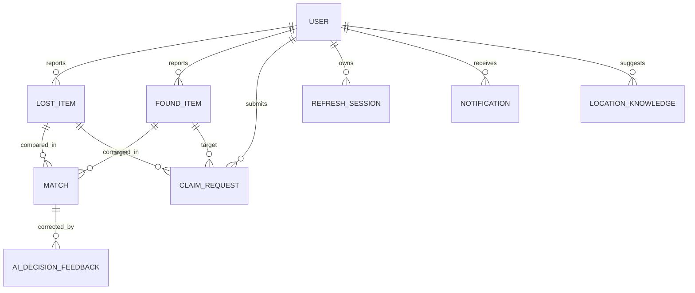

# ER Diagram and Data Dictionary

| Collection | Purpose | Sensitive/high-value fields | Key indexes/controls |
|---|---|---|---|
| users | account/role/profile | email, phone, studentId, password hash | unique email/studentId; deletedAt; privacy serializer |
| refreshsessions | hashed rotating sessions | token hash, device/IP metadata | expiry, user, reuse/revocation |
| lostitems/founditems | reports and lifecycle | approximate location, images, contacts policy | category/status/date/text; soft delete |
| imageanalyses | vision/privacy metadata | masked text, redaction regions, provider data | itemId; moderation decision |
| matches | explainable pair rankings | item/user references, dimensions | unique lost+found; score/status |
| claimrequests | ownership workflow | private description/images/answers, risk | item/claimant/status/risk; participant access |
| notifications | user events | message/link metadata | user/read/date/dedupe |
| outboxevents | idempotent external side effects | event payload (minimised) | status/nextAttempt/dedupe |
| locationknowledge | governed aliases/coordinates | restricted precision/source | status/version/search; admin approval |
| aidecisionfeedback | correction/evaluation governance | user correction/note | pending approval; target/user/decision |
| adminlogs | privileged audit trail | actor/action/target/IP | date/action/actor; append-oriented |
| systemsettings | typed configuration | private keys must never be public | public allowlist/type validation |

Field-level schemas remain authoritative in `backend/models/`. Migrations must backfill new quality, risk, feedback and location fields without exposing private data.
