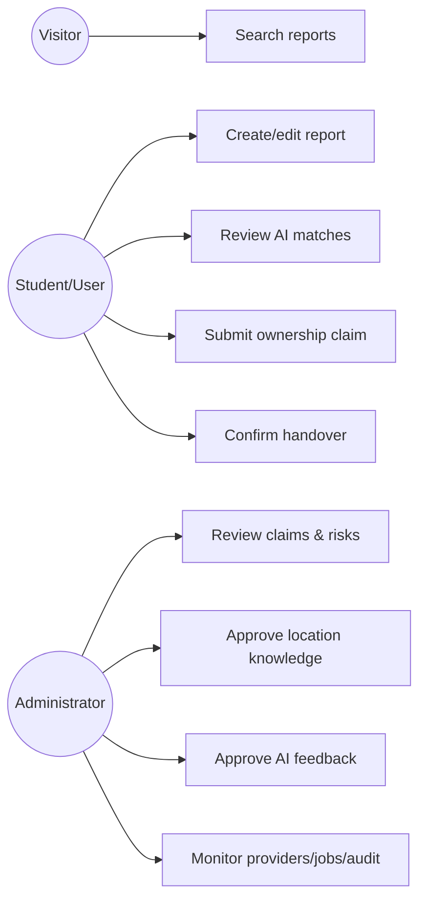
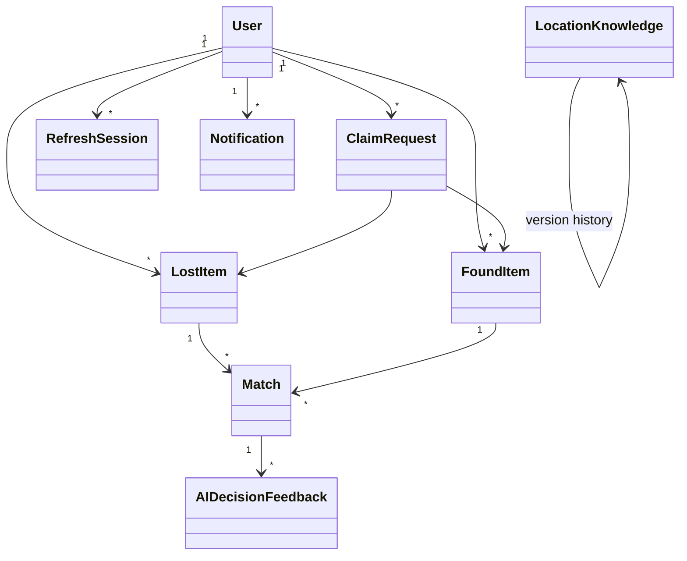
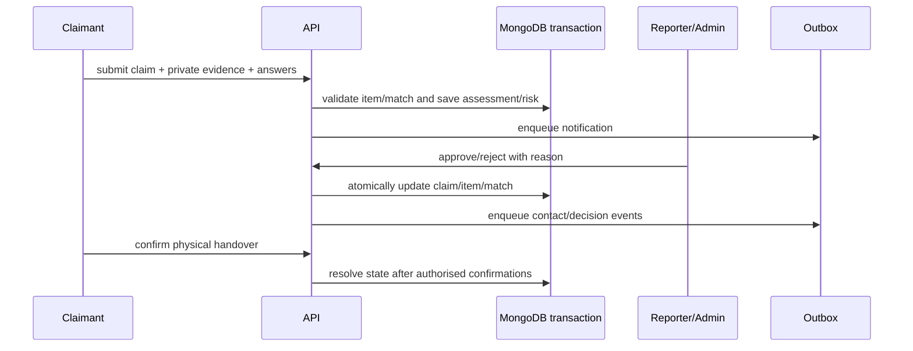
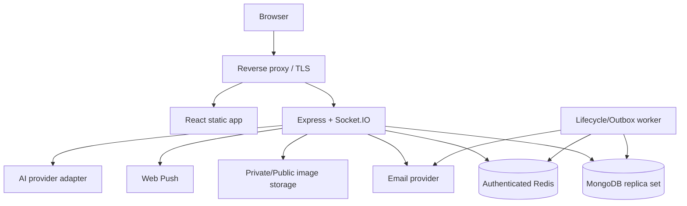

# UML and Architecture Package

## Use cases

```mermaid
flowchart LR
  Visitor((Visitor)) --> Search[Search reports]
  User((Student/User)) --> Report[Create/edit report]
  User --> Matches[Review AI matches]
  User --> Claim[Submit ownership claim]
  User --> Handover[Confirm handover]
  Admin((Administrator)) --> Review[Review claims & risks]
  Admin --> Location[Approve location knowledge]
  Admin --> Feedback[Approve AI feedback]
  Admin --> Ops[Monitor providers/jobs/audit]
```

## Domain class view

```mermaid
classDiagram
 User "1" --> "*" LostItem
 User "1" --> "*" FoundItem
 LostItem "1" --> "*" Match
 FoundItem "1" --> "*" Match
 User "1" --> "*" ClaimRequest
 ClaimRequest --> LostItem
 ClaimRequest --> FoundItem
 Match "1" --> "*" AIDecisionFeedback
 User "1" --> "*" RefreshSession
 User "1" --> "*" Notification
 LocationKnowledge --> LocationKnowledge : version history
```

## Claim sequence

```mermaid
sequenceDiagram
 participant U as Claimant
 participant API
 participant DB as MongoDB transaction
 participant R as Reporter/Admin
 participant O as Outbox
 U->>API: submit claim + private evidence + answers
 API->>DB: validate item/match and save assessment/risk
 API->>O: enqueue notification
 R->>API: approve/reject with reason
 API->>DB: atomically update claim/item/match
 API->>O: enqueue contact/decision events
 U->>API: confirm physical handover
 API->>DB: resolve state after authorised confirmations
```

## Deployment

```mermaid
flowchart TB
 Browser --> HTTPS[Reverse proxy / TLS]
 HTTPS --> Web[React static app]
 HTTPS --> API[Express + Socket.IO]
 API --> Mongo[(MongoDB replica set)]
 API --> Redis[(Authenticated Redis)]
 API --> Images[Private/Public image storage]
 API --> Mail[Email provider]
 API --> Push[Web Push]
 API --> AI[AI provider adapter]
 Worker[Lifecycle/Outbox worker] --> Mongo
 Worker --> Redis
 Worker --> Mail
```
