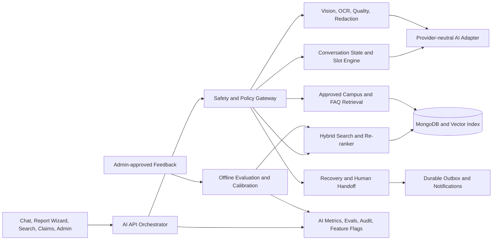

# Smart L&F AI Platform Implementation Roadmap (AI-01 to AI-21)

**Prepared:** 2026-09-03  
**Scope:** All 21 requested AI capabilities across backend, frontend, data, privacy, evaluation, operations, and deployment.  
**Planning basis:** Current repository source is authoritative. Existing AI work is reused; `implemented` does not mean live-provider or university acceptance is complete.

**Implementation update (2026-09-04):** All AI-01 to AI-21 capabilities are implemented in the local source and have deterministic regression coverage. See [`AI_PLATFORM_CAPABILITY_MATRIX_2026.md`](./AI_PLATFORM_CAPABILITY_MATRIX_2026.md) for exact evidence and the external acceptance gates that still prevent a production-certified claim.

## 1. Outcome and non-negotiable rules

The target is a multilingual, privacy-first lost-and-found assistant that can understand a user over multiple turns, create a reviewable report, find and explain likely matches, guide recovery, and escalate to a human. AI remains advisory.

- No AI output proves ownership, approves a claim, exposes private evidence, or completes a handover.
- Report submission requires authentication, an explicit review screen, and a final user confirmation.
- Only admin-approved feedback and verified recovery outcomes may enter evaluation or calibration datasets.
- Raw passwords, PINs, CVVs, full card/ID numbers, private addresses, and unredacted OCR text are never retained in AI logs or training data.
- Provider calls use the existing provider-neutral adapter, bounded timeouts, schema validation, circuit breakers, fallbacks, and purpose-specific models.
- English, Sinhala, Tamil, and Romanized Sinhala (Singlish) receive equal acceptance testing.
- Every generated decision carries provenance, model/algorithm version, confidence, limitations, and a human-review route.
- Every capability ships behind a feature flag with a safe rollback path.

## 2. Current-source baseline and exact gaps

| ID | Requested capability | Current status | Reuse and missing work |
|---|---|---|---|
| AI-01 | Remember details and ask one missing detail at a time | Partial | Browser-local bounded chat history and short provider context exist. Add structured slot state, server-validated state transitions, priority-based next question, expiry, and user-visible clear/reset. |
| AI-02 | Correct wrong details in conversation | Partial | New messages can be re-parsed, but there is no explicit correction intent or field-level state merge. Add correction detection, before/after confirmation, conflict handling, and audit metadata. |
| AI-03 | Build complete report and submit after approval | Partial | Reviewable draft extraction and report-wizard handoff exist. Add completeness state, review summary, explicit confirmation token, idempotent submission, authentication recovery, and post-submit receipt. |
| AI-04 | Semantic multilingual/typo-tolerant search | Partial | Unicode normalisation, aliases, bounded fuzzy matching, and weighted search exist. Add multilingual embeddings, hybrid lexical/vector retrieval, re-ranking, backfill, and measured recall/precision. |
| AI-05 | Strong photo similarity and OCR | Provider-dependent | Image analysis, masked OCR evidence, and bounded dual-image comparison exist. Add perceptual hash, embedding similarity, OCR confidence/regions, image-quality gates, provider UAT, and calibrated fusion. |
| AI-06 | Improve from user-approved match feedback | Partial | `AIDecisionFeedback`, admin review, and algorithm versioning exist. Add immutable approved dataset exports, offline weight/calibration jobs, experiment registry, champion/challenger evaluation, and rollback. No uncontrolled online learning. |
| AI-07 | Prompt-injection, privacy, and hallucination guardrails | Partial | Length bounds, safe serializers, JSON validators, privacy masking, rate limits, provider failover, and human-review notices exist. Add dedicated input/output policy gateway, prompt-injection detection, tool allowlists, grounded-answer checks, and red-team tests. |
| AI-08 | Automated multilingual AI evals | Partial | Unit/source tests exist. Add a versioned golden corpus, deterministic eval runner, language/intent/search/match/privacy metrics, adversarial cases, CI thresholds, trend reports, and release blocking. |
| AI-09 | Voice input/output and proactive notifications | Partial | Browser speech input hooks and match notifications exist. Add TTS, explicit microphone consent, unsupported-browser fallback, transcript review, notification confidence tiers, quiet hours, dedupe, and live delivery UAT. |
| AI-10 | Spelling correction for `cateen`, `libry`, Singlish | Partial | Fuzzy matching and a curated alias dictionary exist. Add correction candidates, confidence thresholds, language-aware transliteration, “did you mean” UX, admin-approved alias growth, and eval cases. |
| AI-11 | Campus knowledge AI | Field-data-dependent | SEUSL location data, sensitivity levels, alias resolution, and admin governance exist. Add verified buildings/hostels/faculties/landmarks, relationships, versioning, provenance, restricted precision, and institutional approval workflow. |
| AI-12 | Smart high-confidence match notifications | Partial | Strong-match notifications, realtime sockets, push preferences, and dedupe exist. Add calibrated eligibility, evidence-quality minimums, digest/escalation rules, quiet hours, delivery observability, and false-alert feedback. |
| AI-13 | Privacy-safe lost-item poster generator | Missing | Add approved templates, safe-field projection, redacted image selection, multilingual copy, QR/deep link, preview/edit/download, expiry/watermark, and audit trail. |
| AI-14 | Photo-quality checker | Partial | Provider returns `imageQuality`; upload transforms exist. Add blur/exposure/resolution/occlusion checks, actionable retake guidance, hard/soft thresholds, offline fallback, and mobile camera UAT. |
| AI-15 | Sensitive-data detector and auto blur | Partial/implemented foundation | OCR masking, redaction regions, client pixelation, manual review, and safe-public media exist. Add broader document/card/face/text classes, confidence policy, re-scan after redaction, zero-leak tests, and live-provider/storage acceptance. |
| AI-16 | Duplicate/spam report detector | Partial | Own-report duplicate scoring, image spam signal, claim-risk flags, and human review exist. Add cross-account duplicate clusters, perceptual hashes, burst/rate/device-safe signals, appeal flow, and admin evidence UI. Never auto-ban solely from AI. |
| AI-17 | Human handoff to admin/helpdesk | Missing | General feedback/admin workflows exist, but no assistant handoff. Add handoff reasons, consented transcript summary, queue/SLA/status, participant messaging boundary, notifications, and closure feedback. |
| AI-18 | Admin analytics AI | Partial/strong foundation | Aggregate operational summaries, hotspots, cohort intervals, recovery analytics, and sample-size gates exist. Add natural-language explanations grounded only in aggregates, anomaly alerts, saved briefs, export, and drift dashboards. |
| AI-19 | Accessibility image descriptions | Partial | Generic alt text and image-analysis descriptions exist. Add concise generated captions, decorative/informative choice, user edit/approval, language variants, screen-reader preview, and safe public serialization. |
| AI-20 | Recovery assistant | Partial | Claim questions, evidence quality, claim risk, notifications, workflow timeline, and safe handover exist. Add state-aware chatbot guidance, role-specific next action, deadline/reminder handling, safety rules, and human escalation. |
| AI-21 | University FAQ assistant | Missing | Static policy/help content exists. Add curated RAG over approved university/system documents, citations, document versioning, freshness review, permission-aware retrieval, and “not found / contact support” behavior. |

## 3. Target architecture



The AI API orchestrator owns intent routing and structured responses. It never gives the model direct database or arbitrary URL access. Services expose bounded, allowlisted operations only.

## 4. Shared contracts and data changes

### 4.1 New collections

| Collection | Minimum fields and controls |
|---|---|
| `AssistantSession` | `ownerId` or anonymous session hash, locale/style, intent, sanitized slots, missing slots, state version, consent flags, last activity, `expiresAt` TTL, status. Store only bounded/redacted message summaries; default expiry 7 days. |
| `AIKnowledgeArticle` | type (`campus`/`faq`), title, semantic sections, approved translations, source URL/document ID, visibility, campus relationships, version, checksum, status, approver, review/expiry dates. Only approved versions are retrievable. |
| `AIEmbeddingRecord` | target type/id/version, sanitized text checksum, embedding model/dimensions/vector, generated date, status. Unique compound index prevents duplicate work; deletion follows source retention. Prefer MongoDB Atlas Vector Search to avoid a second database. |
| `AIEvaluationCase` | dataset/version, language, capability, sanitized input, expected structured result, severity, provenance, approval state. Production private data is excluded unless separately consented and de-identified. |
| `AIEvaluationRun` | code/model/prompt/dataset versions, per-capability metrics, failures, cost, latency, release decision, immutable artifact checksum. |
| `AssistantHandoff` | requester, reason, consented redacted summary, related report/claim, priority, status, assigned admin, SLA timestamps, resolution, satisfaction. Participant/admin access only. |
| `PosterAsset` | owner, report, template/language/version, safe fields used, redacted media reference, expiry, checksum, status. Poster generation is preview-first and deleted with its report. |

### 4.2 Existing-schema extensions

- `LostItem` / `FoundItem`: embedding version/status, normalized multilingual search document checksum, perceptual image hashes, poster references, and AI provenance. Never embed private claim evidence.
- `ImageAnalysis`: OCR regions and categories, masked text only, image-quality sub-scores, perceptual hash, visual embedding reference, accessibility caption drafts/approved captions, provider/model/prompt versions.
- `Match`: ranker version, component scores, calibrated probability band, notification eligibility/reason, experiment ID, and feedback aggregate. Keep the existing “not proof of ownership” contract.
- `AIDecisionFeedback`: dataset eligibility, approval reason, de-identification status, export batch ID, and evaluation split. Admin approval remains mandatory.
- `Notification`: confidence tier, channel attempts, delivery state, quiet-hour deferral, digest group, and immutable dedupe key.
- `OutboxEvent`: add versioned types for embedding refresh, match notification, poster generation, handoff notification, and evaluation export; keep leasing, retries, dead-letter retention, and idempotency.

### 4.3 API contract

Extend existing routes instead of creating parallel implementations:

- `POST /api/ai/chat`: accepts `sessionId`, message, locale/style, and client state version; returns sanitized slots, changed fields, next question, draft completeness, grounded answer citations, actions, and state version.
- `POST /api/ai/conversations`: creates anonymous or authenticated TTL session with explicit retention notice.
- `GET /api/ai/conversations/:id`, `DELETE /api/ai/conversations/:id`: participant access and immediate erasure.
- `POST /api/ai/conversations/:id/confirm-report`: requires auth + CSRF + current state version + single-use confirmation token; creates through existing lost/found controller/service transaction and returns the report receipt.
- `POST /api/ai/search`: hybrid lexical/vector search with filters, pagination, reasons, score components, and safe public projection.
- Keep `/api/ai/suggest-details`, `/api/ai/location/resolve`, and `/api/ai/report/assess`; version their response schemas and add provider/provenance metadata.
- `POST /api/ai/faq`: approved-document retrieval with citations and visibility checks; may also be routed through `/api/ai/chat`.
- `POST /api/ai/posters`, `GET /api/ai/posters/:id`, `DELETE /api/ai/posters/:id`: owner-only preview/generation/lifecycle.
- `POST /api/ai/handoffs`, `GET /api/ai/handoffs/:id`, `PATCH /api/ai/handoffs/:id`: consent, participant/admin authorization, status transitions, and audit.
- Admin routes: knowledge approval/versioning, eval run/report, experiment activation/rollback, handoff queue, and AI incident metrics.

All mutation routes require schema validation, CSRF, role checks, idempotency where relevant, audit logs, rate limits, and localized stable error codes. Update `docs/api/openapi.yaml` in the same implementation batch as each endpoint.

## 5. Delivery phases

Estimates assume one experienced full-stack engineer, existing MongoDB/Redis/Cloudinary infrastructure, and timely provider/university access. Total: approximately **52–70 engineering days (10–14 weeks)**. Parallel team work can shorten elapsed time, but not provider, field-data, privacy, or UAT gates.

### Phase 0 — Baseline freeze and decisions (2–3 days)

**Coverage:** foundation for all IDs.

- Snapshot current AI prompts, algorithms, provider settings, test counts, latency/fallback metrics, data schemas, and live feature flags.
- Create architecture decision records for MongoDB Atlas Vector Search, session retention, browser-first voice, poster branding, handoff SLA, and approved knowledge ownership.
- Reconcile this roadmap with `AI_CAPABILITY_STATUS_MATRIX.md`, SRS, OpenAPI, DPIA, privacy notice, processor register, and operations manuals.
- Add feature-flag registry and environment validation without adding secrets to source.

**Gate:** clean full test/lint/build baseline; architecture, privacy owner, and university content owner recorded.

### Phase 1 — Safety gateway, observability, and eval foundation (5–7 days)

**Coverage:** AI-07, AI-08; required by every later phase.

**Backend**

- Add `aiSafetyService`: Unicode normalization, injection/jailbreak signals, PII/secrets classification, maximum payload budgets, safe refusal codes, and output leakage checks.
- Add purpose-specific system prompts, versioned prompt registry, strict JSON schemas, grounding/provenance validator, URL/tool allowlist, and safe fallbacks.
- Extend provider metrics with prompt/model version, purpose, result class, token/cost estimate, p50/p95 latency, fallback rate, schema rejection, safety rejection, and circuit state. Never log raw prompts or private fields.
- Create `AIEvaluationCase`, `AIEvaluationRun`, seed loader, and `npm run eval:ai` supporting deterministic mocks and optional live-provider runs.

**Frontend/admin**

- Localized safe refusal/retry UI; never show provider errors or raw model output.
- Admin AI health/eval page: version, last run, regressions, fallbacks, latency, cost budget, safety cases, and rollback action.

**Tests and gate**

- Injection, data-exfiltration, unsafe URL, malformed JSON, prompt disclosure, PII leakage, timeout, failover, and fallback suites.
- 100% structural schema validity in deterministic CI; zero critical-secret/PII leaks in release corpus; no regression beyond approved metric thresholds.

### Phase 2 — Stateful conversation, corrections, report approval, and recovery guidance (8–10 days)

**Coverage:** AI-01, AI-02, AI-03, AI-20.

**Backend**

- Add slot schema for report type, item, category, colour, brand/model, description, unique marks, location, date/time, custody/storage, and image state.
- Implement finite states: `discovering → collecting → reviewing → awaiting-auth → confirming → submitted`, plus cancelled/expired/handoff paths.
- Parse every turn into `set`, `replace`, `remove`, `confirm`, `reject`, and `unknown` operations. Apply optimistic state versioning so stale tabs cannot overwrite corrections.
- Ask exactly one highest-value missing question; never repeat answered fields unless confidence conflict needs confirmation.
- Produce field-level source/confidence, changed-field summary, missing-field list, and deterministic fallback questions.
- Generate a single-use confirmation token bound to user, session, draft checksum, report type, and expiry. Submit idempotently through existing report workflows; never let the model call the database directly.
- Route claim/match/handover questions to a state-aware recovery policy that exposes only authorized data and offers human escalation.

**Frontend**

- Conversation progress card, editable field chips, correction confirmation, “review report” sheet, completeness/errors, sign-in recovery, explicit “Submit report” confirmation, receipt/deep link, and undo before submission.
- Preserve accessible keyboard, screen reader, mobile visual viewport, bounded local history, and English/Sinhala/Tamil/Singlish style continuity.

**Tests and gate**

- Multi-turn, correction, deletion, contradiction, stale version, reload, expiry, anonymous-to-auth transition, double-click/idempotency, authorization, and language-switch cases.
- No report created without explicit confirmation; corrected field persists while unrelated slots remain unchanged; the assistant asks one relevant missing question.

### Phase 3 — Hybrid semantic search, spelling, campus knowledge, and FAQ RAG (7–9 days)

**Coverage:** AI-04, AI-10, AI-11, AI-21.

**Search and spelling**

- Build sanitized multilingual search documents and embeddings for active public reports; enqueue refresh on create/update/archive/delete.
- Combine existing lexical/fuzzy score, vector similarity, location/date feasibility, visibility, and evidence quality. Re-rank a bounded candidate set and return component reasons.
- Add language-aware spelling/transliteration candidates with conservative confidence. Low-confidence corrections appear as “Did you mean?” and never silently alter unique identifiers.
- Backfill in resumable batches with checksums, leases, retry/dead-letter behavior, progress metrics, and rollback to lexical search.

**Campus and FAQ knowledge**

- Model buildings, faculties, hostels, offices, landmarks, aliases, parent/nearby relationships, sensitivity, provenance, validity period, and approval state.
- Import only institution-approved sources. Restricted locations return zone-level descriptions; coordinates and private offices follow role-based precision rules.
- Semantically chunk approved FAQ/policy documents, keep citations/version/checksum, filter by visibility, and refuse unsupported answers with a support/handoff action.

**Tests and gate**

- Typo, transliteration, Sinhala/Tamil/Singlish, alias collision, restricted-location, stale-knowledge, citation, permission, embedding outage, and backfill-resume cases.
- Hybrid recall@5 and top-result relevance must beat the frozen lexical baseline on the approved corpus; citation correctness 100% for FAQ answers; lexical fallback remains functional.

### Phase 4 — Vision, OCR, photo quality, redaction, captions, and posters (10–14 days)

**Coverage:** AI-05, AI-13, AI-14, AI-15, AI-19.

**Vision pipeline**

- Run cheap deterministic checks first: MIME/signature, decode, dimensions, blur, exposure, contrast, entropy, duplicate/perceptual hash, and file limits.
- Send only accepted/redacted images to allowlisted vision models. Validate item attributes, OCR regions, moderation, quality, accessibility caption, and visual embedding against strict schemas.
- Store masked OCR evidence and coordinates, never unrestricted raw OCR text. Sensitive classes include identity/student cards, full phone/email/address, payment cards, QR/barcodes, faces when policy requires, passwords/PIN-like text, and documents.
- Require manual review when sensitivity confidence is uncertain. After pixelation/crop/rotation, re-run checks on the replacement file before public upload.
- Fuse perceptual hash, visual embedding, provider comparison, and existing structured evidence. Expensive dual-image provider calls remain limited to top candidates.

**User experience**

- Show actionable photo guidance: too dark, blurred, item too small, glare, document visible, or multiple items. Allow retake/replace/continue-to-manual-review according to risk.
- Create editable, approved accessibility captions per language. Public `alt` uses approved caption or safe item name fallback; private details are excluded.
- Poster builder uses approved templates and only safe public projection: item category/name, approximate approved location, date, public contact workflow link, redacted image, expiry, and QR/deep link. User previews/edits before generation; direct phone/student ID/ownership secrets are forbidden.

**Tests and gate**

- Corrupt image, tiny/huge image, blur/exposure, rotated OCR, card/ID/phone/QR/face regions, redaction rescan, two-image ordering, provider disagreement, caption privacy, poster field allowlist, deletion/expiry, and mobile camera cases.
- Zero known sensitive strings in saved public images/posters for the release corpus; low-confidence privacy detections block publication until manual review; vision outage preserves manual reporting.

### Phase 5 — Feedback learning, calibration, duplicate/spam defense, and admin intelligence (8–10 days)

**Coverage:** AI-06, AI-16, AI-18.

**Feedback and experiments**

- Export only approved, de-identified feedback with target snapshots, algorithm versions, labels, provenance, and train/validation/test split IDs.
- Build offline tuning for match weights, confidence calibration, spelling aliases, and notification thresholds. Never auto-update production from individual feedback.
- Add experiment registry: immutable config/version, dataset checksum, metrics, approver, activation time, exposure percentage, and rollback target.
- Champion/challenger runs operate in shadow mode first; activation requires no safety regression and statistically meaningful approved-data improvement.

**Duplicate/spam and abuse**

- Cluster likely duplicate reports using normalized fields, date/location windows, perceptual hashes, embeddings, and account-independent evidence.
- Add bounded behavioral signals: report bursts, repeated rejected claims, reused media, and duplicate content. Avoid invasive fingerprinting and protected-attribute/user profiling.
- Results are `allow`, `review`, or `rate-limit`; only deterministic policy can block obviously invalid payloads. AI suspicion alone never bans an account or rejects ownership.
- Admin UI shows evidence, uncertainty, related records, action history, appeal status, and safe resolution options.

**Admin intelligence**

- Extend existing aggregate briefs with grounded explanations, anomaly detection, saved reports, time/category/location filters, cohort intervals, and export.
- Preserve minimum sample sizes, verified-outcome-only policy, no individual prediction, and restricted-location aggregation.

**Tests and gate**

- Feedback poisoning, unapproved-data exclusion, dataset leakage, split contamination, calibration, rollback, duplicate clusters, false-positive appeals, concurrent review, and aggregate privacy tests.
- Approved holdout metrics improve or remain within the release tolerance; no unapproved feedback enters an eval/tuning artifact; admin can reproduce and roll back every active configuration.

### Phase 6 — Voice, smart notifications, and human handoff (7–10 days)

**Coverage:** AI-09, AI-12, AI-17.

**Voice**

- Browser-native speech recognition first, with typed fallback. Add TTS using browser voices, locale-aware selection, rate/pitch controls, stop/replay, and reduced-motion/accessibility compatibility.
- Microphone starts only after explicit user action and visible consent. Transcript is editable before send; audio is not stored by default.
- If a cloud STT/TTS fallback is later enabled, update DPIA/processor register, show consent, enforce short retention, and expose deletion.

**Notifications**

- Eligibility requires calibrated match tier, minimum evidence quality, active reports, participant preferences, and no previous notification for the same match/version.
- Add immediate versus digest policy, quiet hours, channel fallback, retry/dead-letter, delivery receipt, deep links, and false-alert feedback.
- Extend durable outbox instead of sending within request transactions. In-app remains the auditable baseline; push/email fail closed without configured providers.

**Human handoff**

- Handoff triggers: user request, repeated fallback, unsupported FAQ, safety concern, disputed correction, claim/handover help, or low-confidence recovery path.
- Before creation, show exactly what redacted summary and related record IDs will be shared. Raw private chat/audio is excluded unless the user explicitly selects it.
- Admin queue supports priority, assignment, SLA, notes, participant-safe replies, status notifications, closure reason, and satisfaction feedback.

**Tests and gate**

- Microphone consent, transcript edit, language switching, TTS stop, unsupported browser, notification dedupe/quiet hours/channel failure, handoff authorization/consent/SLA/concurrency/deletion tests.
- Zero duplicate notifications in concurrency tests; voice always has a complete typed path; handoff data is inaccessible to nonparticipants.

### Phase 7 — Integrated release, field validation, and operations (5–7 days)

**Coverage:** final integration of AI-01 through AI-21.

- Update SRS, architecture/UML, ER/data dictionary, OpenAPI, AI transparency notice, privacy/retention policies, processor register, user/admin/support manuals, incident response, deployment guide, and capability matrix.
- Run migration/backfill in dry-run, sampled verification, resumable production mode, and post-migration count/checksum audit.
- Execute full automated suites, AI evals, browser/mobile/accessibility tests, performance/load tests, provider failover drills, outbox recovery, backup/restore, and rollback rehearsal.
- Conduct staff pilot with seeded nonprivate cases, then university-approved field data. Record Sinhala/Tamil/Singlish usability, false matches, OCR/privacy misses, notification fatigue, and handoff SLA.
- Roll out through disabled → internal shadow → staff pilot → 10% → 50% → 100%, with per-capability kill switches and previous algorithm/prompt versions retained.
- Verify Vercel frontend and Railway backend independently. Production completion requires live provider health, Mongo vector index, Redis/outbox, Cloudinary privacy lifecycle, email/push providers, logs, and target URLs—not only a successful local build.

**Gate:** every feature acceptance criterion below has evidence; no open critical/high privacy or security issue; operational owners and rollback runbook signed off.

## 6. Acceptance criteria for every requested capability

| ID | Definition of done |
|---|---|
| AI-01 | Across reload and at least 10 turns, approved session state retains correct fields, expires/clears correctly, and asks only the highest-priority unanswered or conflicted question. |
| AI-02 | “No, the bag is blue” changes only colour, shows old → new, supports undo, handles stale state, and does not silently overwrite another field. |
| AI-03 | A complete draft is editable and summarized; submission requires auth and explicit single-use confirmation; retries create exactly one report and return its receipt. |
| AI-04 | On the approved multilingual corpus, hybrid search beats frozen lexical baseline for recall@5/NDCG@5 without exceeding the agreed irrelevant top-result rate; provider outage uses lexical fallback. |
| AI-05 | Photo pairs produce versioned component scores and explanations; OCR is region/confidence-aware; live-provider UAT passes; weak/missing vision never presents a high-confidence ownership conclusion. |
| AI-06 | Only approved/de-identified feedback enters immutable datasets; offline experiment is reproducible; holdout metrics and safety pass; activation is approved, versioned, and reversible. |
| AI-07 | Adversarial suite blocks or safely handles injection/exfiltration/tool abuse; critical secrets/PII leaks are zero; unsupported claims receive grounded refusal/handoff. |
| AI-08 | CI runs versioned Sinhala/Tamil/Singlish/English, search, match, vision, privacy, fallback, and adversarial evals; failed release thresholds block promotion and appear in an admin report. |
| AI-09 | Voice works where supported, has full typed fallback, editable transcript, explicit consent, no default audio retention, locale-correct TTS, and accessible stop/replay controls. |
| AI-10 | Approved common typo/transliteration cases resolve correctly; ambiguous corrections ask for confirmation; IDs/serials are never autocorrected. |
| AI-11 | Approved campus entities/aliases resolve with provenance and version; restricted locations return reduced precision; stale/unapproved records never ground public answers. |
| AI-12 | Eligible high-confidence matches generate one preference-aware notification per match/version, respect quiet hours/digests, expose reason/deep link, and collect false-alert feedback. |
| AI-13 | Poster uses only allowlisted public fields and redacted media, is editable/previewed before generation, supports all languages, carries expiry/deep link, and is deleted with the report. |
| AI-14 | Blur/exposure/resolution/occlusion guidance is actionable and tested on mobile; unsafe/undecodable images fail safely; manual reporting remains available. |
| AI-15 | Sensitive regions are detected, previewed, redacted, and re-scanned; uncertain results require manual review; the release corpus contains zero known sensitive public leaks. |
| AI-16 | Duplicate/spam evidence is explainable and appealable; obvious deterministic abuse can be rate-limited; AI-only suspicion never auto-bans or rejects a legitimate report/claim. |
| AI-17 | User consents to a redacted handoff summary; participant/admin authorization, assignment, SLA, replies, status notifications, closure, and deletion/retention all work. |
| AI-18 | Every generated admin statement maps to current aggregate data, minimum samples and intervals are shown, individual predictions are forbidden, and reports are reproducible/exportable. |
| AI-19 | Generated caption is privacy-safe, editable, approved, localized, and used by screen readers; decorative images remain empty-alt and public fallback is safe. |
| AI-20 | Assistant gives correct role/status next action through match, claim, verification, contact sharing, handover, resolution, and dispute paths without exposing restricted evidence. |
| AI-21 | FAQ answers quote no hidden content, cite exact approved sources/versions, respect permissions, identify stale/missing knowledge, and offer support instead of inventing an answer. |

## 7. Evaluation and release scorecard

### 7.1 Dataset strata

- Languages/styles: English, Sinhala script, Tamil script, natural Singlish, mixed-code input, common Tamil/Sinhala transliteration, and spelling mistakes.
- Workflows: lost, found, ambiguous, search-only, report creation, correction, cancellation, claim, handover, FAQ, and human escalation.
- Matching: true/false/uncertain pairs stratified by category, location, time, text completeness, image availability, and sensitive evidence.
- Safety: injection, prompt extraction, unauthorized private-data request, credentials/payment/identity data, unsafe links, harassment/spam, and model/provider malformed output.
- Reliability: provider disabled, timeout, partial outage, circuit open, Redis unavailable, duplicate outbox delivery, stale session/version, and migration retry.

### 7.2 Metrics

- Conversation: intent accuracy, slot precision/recall, correction accuracy, repeated-question rate, draft completion rate, explicit-confirmation compliance, user abandonment.
- Search/matching: recall@5, precision@1/3, NDCG@5, false-positive rate, calibration error/Brier score, per-language parity, no-evidence high-score rate.
- Vision/privacy: quality classification accuracy, OCR region recall, sensitive-region recall/precision, redaction verification, caption privacy/utility, provider disagreement.
- FAQ: answer groundedness, citation correctness, retrieval recall, unsupported-answer refusal rate, stale-source rate.
- Operations: p50/p95 latency, provider success/fallback/schema-rejection rate, token/cost per purpose, cache hit, outbox retries/dead letters, notification delivery/dedupe, handoff SLA.
- Accessibility/UX: WCAG keyboard/screen-reader flow, 44px targets, mobile overflow/keyboard collision, speech fallback, translated copy completeness.

Thresholds must be frozen in a versioned release policy after baseline measurement. Safety invariants (no unauthorized disclosure, no submission without confirmation, no AI-only ownership decision) are zero-tolerance regardless of aggregate score.

## 8. Feature flags and rollback controls

- `AI_CONVERSATION_V2_ENABLED`
- `AI_CONVERSATION_PERSISTENCE_ENABLED`
- `AI_HYBRID_SEARCH_ENABLED`
- `AI_EMBEDDING_BACKFILL_ENABLED`
- `AI_VISION_V2_ENABLED`
- `AI_OCR_REDACTION_V2_ENABLED`
- `AI_POSTER_ENABLED`
- `AI_ACCESSIBILITY_CAPTIONS_ENABLED`
- `AI_FEEDBACK_EXPERIMENT_ENABLED`
- `AI_SPAM_REVIEW_ENABLED`
- `AI_VOICE_OUTPUT_ENABLED`
- `AI_SMART_NOTIFICATIONS_V2_ENABLED`
- `AI_HUMAN_HANDOFF_ENABLED`
- `AI_FAQ_RAG_ENABLED`
- `AI_ADMIN_NARRATIVE_ENABLED`

Flags default off in production until their gate passes. Rollback disables the capability, stops new async events, preserves auditable records, and falls back to the current deterministic/manual workflow. Migrations are additive first; destructive cleanup occurs only after rollback windows and backups.

## 9. Required implementation surface

### Backend

- New orchestrator/state/safety/embedding/RAG/eval/poster/handoff services with small, testable contracts.
- New schemas, validators, serializers, controllers, routes, migrations, seeds, outbox handlers, indexes, TTLs, and admin audit events.
- Existing report, match, claim, location, notification, Cloudinary, email, socket, Redis, and transaction services remain authoritative workflow owners.

### Frontend

- Upgrade `AIChatbot` into state-aware conversation/review/recovery/FAQ/handoff UI without losing mobile full-screen behavior, local-history controls, accessibility, or translations.
- Add semantic search correction chips, vision-quality guidance, privacy review, caption editor, poster preview, smart-notification explanation/preferences, and handoff tracking.
- Add admin knowledge, eval/experiment, abuse review, delivery health, and handoff queue surfaces.

### Documentation and operations

- Update OpenAPI and data dictionary with every contract/schema change.
- Update DPIA, AI transparency, privacy/retention, acceptable use, processor register, incident response, backup/restore, user/admin/support manuals, UAT, and production checklist.
- Define owners for AI platform, privacy review, campus/FAQ content, support queue, model budget, incident response, and release approval.

## 10. Small-detail checklist that must not be lost

- Localized loading, empty, retry, offline, expired, stale, conflict, permission, provider-unavailable, manual-review, and success states.
- Mobile keyboard/safe-area behavior; touch targets; focus trap/restore; ARIA live updates; reduced motion; contrast; long Tamil/Sinhala wrapping.
- Pagination and bounded candidate/history/context sizes; request cancellation; latest-response-wins; duplicate click protection.
- CSRF, rate limits, validation, authorization, privacy-safe serializers, safe remote URL validation, file signatures, upload limits, and malware policy.
- Idempotency, outbox dedupe, leases, retries, dead-letter visibility, reprocessing, deletion propagation, TTL indexes, and timezone correctness.
- Provider/model/prompt/algorithm/dataset versions, provenance, confidence, cost, latency, fallback reason, audit actor, and timestamps.
- Cache invalidation on report edits/deletes, location/FAQ approval, embedding-model change, privacy redaction, and experiment rollback.
- Explicit consent and deletion for conversation persistence, voice cloud processing, poster generation, feedback reuse, and human handoff.
- No silent auto-submit, auto-ban, claim approval, ownership proof, contact sharing, precise restricted location, or private media publication.

## 11. Verification commands and environments

Add dedicated scripts while preserving existing commands:

```text
backend: npm run check && npm run lint && npm test && npm run eval:ai
frontend: npm run lint && npm test && npm run build && npm run test:e2e
```

Verification layers:

1. Unit/contract tests with deterministic provider mocks.
2. MongoDB replica-set + Redis + outbox integration tests.
3. Seeded end-to-end flows for all roles and languages.
4. Mobile/desktop Chrome plus required Firefox/WebKit UAT where available.
5. Optional live-provider eval using synthetic/approved assets only.
6. Preview deployment smoke, privacy, accessibility, performance, and rollback.
7. Separate Vercel production and Railway readiness/runtime checks.
8. University staff field-data and policy sign-off before calling provider/field-dependent features complete.

## 12. Traceability and recommended implementation order

| Phase | IDs completed | Dependency |
|---|---|---|
| 0 | Baseline for AI-01–AI-21 | None |
| 1 | AI-07, AI-08 | Must precede new provider-backed features |
| 2 | AI-01, AI-02, AI-03, AI-20 | Phase 1 |
| 3 | AI-04, AI-10, AI-11, AI-21 | Phases 1–2; approved content/vector index |
| 4 | AI-05, AI-13, AI-14, AI-15, AI-19 | Phase 1; provider/media acceptance |
| 5 | AI-06, AI-16, AI-18 | Phases 1, 3, 4; approved verified outcomes |
| 6 | AI-09, AI-12, AI-17 | Phases 1–5; delivery/support ownership |
| 7 | All 21 release gates | All previous phases |

Coverage audit: **AI-01 through AI-21 each appears in the baseline, a delivery phase, and an explicit definition of done.**

## 13. Decisions required before implementation starts

Recommended defaults are provided so work can start without architecture churn; university/privacy owners can override them before production:

1. Vector search: MongoDB Atlas Vector Search, keeping lexical fallback.
2. Conversation storage: sanitized structured state + redacted summaries, 7-day TTL, immediate user deletion; anonymous persistence is device/session bound.
3. Voice: browser-native STT/TTS first; no stored audio. Cloud voice requires a later processor/privacy approval.
4. Learning: offline admin-approved calibration only; no autonomous production training.
5. FAQ/campus content: named university content owner and periodic expiry/reapproval.
6. Human handoff: participant/admin queue with proposed one-business-day target; final SLA needs institutional approval.
7. Posters: approved university template, approximate location only, no direct contact/identity data, automatic expiry with report.
8. Production rollout: per-feature flags, staff pilot, measured canary, explicit rollback owner.

## 14. Completion rule

This roadmap is complete as a plan, not as an implementation claim. A capability is complete only when source, migrations, tests/evals, documentation, preview evidence, live provider/infrastructure checks where applicable, and human/institutional approvals all satisfy its gate. Any blocked provider, field-data, policy, or account requirement stays visibly open.
